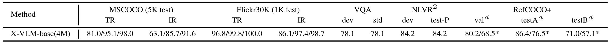

# X-VLM: learning multi-grained vision language alignments

**[Multi-Grained Vision Language Pre-Training: Aligning Texts with Visual Concepts](https://arxiv.org/abs/2111.08276). Yan Zeng, Xinsong Zhang, Hang Li. arXiv 2021.**

- Jan 2022: release official PyTorch implementation and X-VLM-base checkpoints
- Dec 2021: X-VLM-base (4M) achieves new SoTA  
  
- Nov 2021: release preprint in [arXiv](https://arxiv.org/abs/2111.08276)


## Hiring
We are looking for interns at ByteDance AI-LAB (in Beijing / Shanghai)! If you are interested in working with us on vision language models, please send your resume to 
zhangxinsong.0320@bytedance.com.


## Features
- Support several backbones 
    - vision encoder: deit / clip-vit / swin-transformer 
    - text encoder: bert / roberta
- Support apex O1 / O2 for pre-training
- Read from and write to HDFS
- Distributed training across nodes for both pre-training and fine-tuning

Please read the code for more details. 


## Requirements
- Install python3 environment
```angular2html
pip3 install -r requirements.txt
```
- Download raw images from corresponding websites
- Download the json files we provided, which contains image read paths and captions and/or bbox annotations
- If running pre-training scripts: 
  - install Apex
  - download pre-trained models for parameter initialization 
    - image encoder: [swin-transformer-base](https://github.com/SwinTransformer/storage/releases/download/v1.0.0/swin_base_patch4_window7_224_22k.pth)
    - text encoder: [bert-base](https://huggingface.co/bert-base-uncased/tree/main)
- Organize these files like this (% is for pre-training only):  
```angular2html
X-VLM/
    data/
        finetune/
            refcoco+/*.json
            *.json
        
        %pretrain_4m/*.json
        %swin_base_patch4_window7_224_22k.pth
        %bert-base-uncased/
            config.json
            pytorch_model.bin
            tokenizer_config.json
            tokenizer.json
            vocab.txt

    images/
        coco/
            train2014/*.jpg
            val2014/*.jpg
            test2015/*.jpg
        
        visualgenome/
            image/*.jpg
        
        nlvr2/
            images/
                train/0-99/*.png
            dev/*.png
            test1/*.png
        
        %sbu/*.jpg
        %cc-3m/*.jpg
```


## Pretrain
```angular2html
python3 run.py --task "pretrain_4m_base" --dist "1" --output_dir "output/pretrain_4m_base"
```
For distributed training across nodes, see run.py for more details.


#### Data
We are organizing the data and the scripts. All these will be released in [Vision-Language-Data](https://github.com/zengyan-97/Vision-Language-Data) in March.
Please feel free to prepare your own datasets by referring the code in dataset/pretrain_dataset.py. 

#### Checkpoints
[X-VLM-base (4M)](https://drive.google.com/file/d/1B3gzyzuDN1DU0lvt2kDz2nTTwSKWqzV5/view?usp=sharing)  
X-VLM-base 14M, WIP  
X-VLM-large 14M, WIP


## Finetune
```angular2html
python3 run.py --task "vqa" --dist "1" --output_dir "output/vqa" --checkpoint "4m_base_model_state_step_199999.th"
python3 run.py --task "vqa" --dist "all" --output_dir "output/vqa" --output_hdfs "hdfs://xxx/vqa_tmp" --checkpoint "4m_base_model_state_step_199999.th"
python3 run.py --task "vqa" --dist "1" --evaluate --output_dir "output/vqa_eval" --checkpoint "4m_base_finetune/vqa/model_state_epoch_9.th" 
```
See run.py for fine-tuning on other tasks (Retrieval, NLVR2, RefCOCO). We set some python assertions to help you run the code correctly. The fine-tuning scripts are based on [ALBEF](https://github.com/salesforce/ALBEF). We thank the author for opening source their code. 


#### Data 
[download json files](https://drive.google.com/file/d/19SQGClFK9JnP6z4SH-EZ-xKsPQ3haPG5/view?usp=sharing) 


#### Checkpoints and Logs
[retrieval-mscoco](https://drive.google.com/drive/folders/1vJ8oBdKlRKulreGq1LGm1s7FZJ0ldL0c?usp=sharing)  
[retrieval-flickr](https://drive.google.com/drive/folders/1qClf7DfSlOFmaL5rog2Yg4cHCbOzynXO?usp=sharing)  
[vqa](https://drive.google.com/drive/folders/1xrJuaraEUAMfdJJ6gcV7wMVpCyCSVAYk?usp=sharing)  
[nlvr2](https://drive.google.com/drive/folders/1oAL6n8vRoXnMreCDxhUhhi2y-k4XT4tZ?usp=sharing)  
[refcoco](https://drive.google.com/drive/folders/1KCRCkVwIb6lNqpIkm-PVNf8eminL4FKH?usp=sharing)  
[refcoco-bbox](https://drive.google.com/drive/folders/1jMNu2v1oyrcFpTQRRPz8mTkGhbOvVOIk?usp=sharing)  


## Citation
If you use this code, please considering citing:
```
@article{xvlm,
  title={Multi-Grained Vision Language Pre-Training: Aligning Texts with Visual Concepts},
  author={Zeng, Yan and Zhang, Xinsong and Li, Hang},
  journal={arXiv preprint arXiv:2111.08276},
  year={2021}
}
```


### Contact
For issues or help using this code, please submit a GitHub issue.
